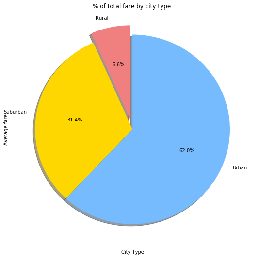

```python
import os
import matplotlib.pyplot as plt
import pandas as pd
import numpy as np
#from bokeh.charts import Scatter
from pylab import*

```


```python
csv_path = os.path.join('raw_data','city_data.csv')
csv_path1=os.path.join('raw_data','ride_data.csv')
cars_df = pd.read_csv(csv_path)
ride_df = pd.read_csv(csv_path1)

```


```python
pyuber = pd.merge(cars_df,ride_df,on='city')
pyuber.head()
```


<div>
<style scoped>
    .dataframe tbody tr th:only-of-type {
        vertical-align: middle;
    }

    .dataframe tbody tr th {
        vertical-align: top;
    }

    .dataframe thead th {
        text-align: right;
    }
</style>
<table border="1" class="dataframe">
  <thead>
    <tr style="text-align: right;">
      <th></th>
      <th>city</th>
      <th>driver_count</th>
      <th>type</th>
      <th>date</th>
      <th>fare</th>
      <th>ride_id</th>
    </tr>
  </thead>
  <tbody>
    <tr>
      <th>0</th>
      <td>Kelseyland</td>
      <td>63</td>
      <td>Urban</td>
      <td>2016-08-19 04:27:52</td>
      <td>5.51</td>
      <td>6246006544795</td>
    </tr>
    <tr>
      <th>1</th>
      <td>Kelseyland</td>
      <td>63</td>
      <td>Urban</td>
      <td>2016-04-17 06:59:50</td>
      <td>5.54</td>
      <td>7466473222333</td>
    </tr>
    <tr>
      <th>2</th>
      <td>Kelseyland</td>
      <td>63</td>
      <td>Urban</td>
      <td>2016-05-04 15:06:07</td>
      <td>30.54</td>
      <td>2140501382736</td>
    </tr>
    <tr>
      <th>3</th>
      <td>Kelseyland</td>
      <td>63</td>
      <td>Urban</td>
      <td>2016-01-25 20:44:56</td>
      <td>12.08</td>
      <td>1896987891309</td>
    </tr>
    <tr>
      <th>4</th>
      <td>Kelseyland</td>
      <td>63</td>
      <td>Urban</td>
      <td>2016-08-09 18:19:47</td>
      <td>17.91</td>
      <td>8784212854829</td>
    </tr>
  </tbody>
</table>
</div>


```python
urban_type = pyuber.groupby(['type'])['fare'].sum()
urban_type.head()
#urban_type = pyuber['type'].groupby(pyuber['fare']).sum()
#urban_type.head()

```


    type
    Rural        4255.09
    Suburban    20335.69
    Urban       40078.34
    Name: fare, dtype: float64


```python
total = pyuber["fare"].sum()
print(round(total,2))

```

    64669.12
    


```python
percentage_fare_bycity=(urban_type/total)*100
percentage_fare_bycity
```


    type
    Rural        6.579786
    Suburban    31.445750
    Urban       61.974463
    Name: fare, dtype: float64


```python
#rural_total=urban_type["Rural"]
#rural_total
#percentage_rural= round((rural_total/total)*100,2)
#percentage_rural
#suburban_total = urban_type["Suburban"]
#print("Suburban Total",suburban_total)
#percentage_suburban = round((suburban_total/total)*100,2)
#print("Suburban_Percentage",percentage_suburban)
#urban_total=urban_type["Urban"]
#print("Urban_Total",urban_total)
#percentage_urban =round((urban_total/total)*100,2)
#print("Urban_Percentage",percentage_urban)
```


```python

labels = "Rural","Suburban","Urban"
explode=[0.1,0,0]
colors= ['lightcoral','gold','xkcd:sky blue']
fare_percentage = percentage_fare_bycity.plot(kind="pie",labels=labels,figsize=(9,9),colors=colors,
                                             shadow=True,explode=explode,startangle=90,autopct='%1.1f%%')

fare_percentage.set_title("% of total fare by city type ")
fare_percentage.set_xlabel("City Type")
fare_percentage.set_ylabel("Average fare")
       
plt.show()
```





```python
#rides= pyuber.groupby(['type','city'])[['ride_id']].count()
#rides.head()
rides= pyuber.groupby(['type'])['ride_id'].count()
rides

```


    type
    Rural        125
    Suburban     657
    Urban       1625
    Name: ride_id, dtype: int64


```python
total_rides = pyuber["ride_id"].count()
total_rides
```


    2407


```python
percentage_rides_type = (rides/total_rides)*100
percentage_rides_type
```


    type
    Rural        5.193187
    Suburban    27.295388
    Urban       67.511425
    Name: ride_id, dtype: float64


```python
labels = "Rural","Suburban","Urban"
explode=[0.1,0,0]
colors= ['gold','xkcd:sky blue','lightcoral']
rides_percentage= percentage_rides_type.plot(kind="pie",labels=labels,figsize=(9,9),colors=colors,
                                             shadow=True,startangle=90,explode=explode,autopct='%1.1f%%')
rides_percentage.set_title("% of total rides by city type ")
rides_percentage.set_xlabel("City type")
rides_percentage.set_ylabel("Rides")

plt.show()
```


```python
driver_total = pyuber.groupby(["type"])["driver_count"].sum()
driver_total
```


    type
    Rural         727
    Suburban     9730
    Urban       64501
    Name: driver_count, dtype: int64


```python
total_driver_count = pyuber["driver_count"].sum()
total_driver_count
```


    74958


```python
percentage_driver_count = (driver_total/total_driver_count)*100
percentage_driver_count
```


    type
    Rural        0.969876
    Suburban    12.980602
    Urban       86.049521
    Name: driver_count, dtype: float64


```python
labels = "Rural","Suburban","Urban"
#sizes = [15,75,55]
explode = [0,0,0.1]
colors= ['xkcd:sky blue','lightcoral','gold']
driver_count_percentage = percentage_driver_count.plot(kind="pie",labels = labels,figsize=(9,9),colors=colors,
                                             shadow=True,startangle=90,explode=explode,autopct='%1.1f%%')

driver_count_percentage.set_title("% of total drivers by city type ",)
driver_count_percentage.set_xlabel("City type")
driver_count_percentage.set_ylabel("Driver Count")
plt.show()
```


```python
new_data=pyuber.iloc[:,[0,2,4,5]]
new_data.head()
```


<div>
<style scoped>
    .dataframe tbody tr th:only-of-type {
        vertical-align: middle;
    }

    .dataframe tbody tr th {
        vertical-align: top;
    }

    .dataframe thead th {
        text-align: right;
    }
</style>
<table border="1" class="dataframe">
  <thead>
    <tr style="text-align: right;">
      <th></th>
      <th>city</th>
      <th>type</th>
      <th>fare</th>
      <th>ride_id</th>
    </tr>
  </thead>
  <tbody>
    <tr>
      <th>0</th>
      <td>Kelseyland</td>
      <td>Urban</td>
      <td>5.51</td>
      <td>6246006544795</td>
    </tr>
    <tr>
      <th>1</th>
      <td>Kelseyland</td>
      <td>Urban</td>
      <td>5.54</td>
      <td>7466473222333</td>
    </tr>
    <tr>
      <th>2</th>
      <td>Kelseyland</td>
      <td>Urban</td>
      <td>30.54</td>
      <td>2140501382736</td>
    </tr>
    <tr>
      <th>3</th>
      <td>Kelseyland</td>
      <td>Urban</td>
      <td>12.08</td>
      <td>1896987891309</td>
    </tr>
    <tr>
      <th>4</th>
      <td>Kelseyland</td>
      <td>Urban</td>
      <td>17.91</td>
      <td>8784212854829</td>
    </tr>
  </tbody>
</table>
</div>


```python
type_urban = new_data.loc[new_data["type"]=="Urban"]
type_urban.head()

```


<div>
<style scoped>
    .dataframe tbody tr th:only-of-type {
        vertical-align: middle;
    }

    .dataframe tbody tr th {
        vertical-align: top;
    }

    .dataframe thead th {
        text-align: right;
    }
</style>
<table border="1" class="dataframe">
  <thead>
    <tr style="text-align: right;">
      <th></th>
      <th>city</th>
      <th>type</th>
      <th>fare</th>
      <th>ride_id</th>
    </tr>
  </thead>
  <tbody>
    <tr>
      <th>0</th>
      <td>Kelseyland</td>
      <td>Urban</td>
      <td>5.51</td>
      <td>6246006544795</td>
    </tr>
    <tr>
      <th>1</th>
      <td>Kelseyland</td>
      <td>Urban</td>
      <td>5.54</td>
      <td>7466473222333</td>
    </tr>
    <tr>
      <th>2</th>
      <td>Kelseyland</td>
      <td>Urban</td>
      <td>30.54</td>
      <td>2140501382736</td>
    </tr>
    <tr>
      <th>3</th>
      <td>Kelseyland</td>
      <td>Urban</td>
      <td>12.08</td>
      <td>1896987891309</td>
    </tr>
    <tr>
      <th>4</th>
      <td>Kelseyland</td>
      <td>Urban</td>
      <td>17.91</td>
      <td>8784212854829</td>
    </tr>
  </tbody>
</table>
</div>


```python
urban_group = type_urban.groupby(['city'])['fare'].mean()
urban_group.head()
                             
                            
```


    city
    Alvarezhaven    23.928710
    Alyssaberg      20.609615
    Antoniomouth    23.625000
    Aprilchester    21.981579
    Arnoldview      25.106452
    Name: fare, dtype: float64


```python
urban_count = type_urban.groupby(['city'])['fare'].count()
urban_count.head()
```


    city
    Alvarezhaven    31
    Alyssaberg      26
    Antoniomouth    22
    Aprilchester    19
    Arnoldview      31
    Name: fare, dtype: int64


```python
urban_ride = type_urban.groupby(['city'])['ride_id'].count()
urban_ride.head()
```


    city
    Alvarezhaven    31
    Alyssaberg      26
    Antoniomouth    22
    Aprilchester    19
    Arnoldview      31
    Name: ride_id, dtype: int64


```python
type_suburban = new_data.loc[new_data["type"]=="Suburban"]
type_suburban.head()
```


<div>
<style scoped>
    .dataframe tbody tr th:only-of-type {
        vertical-align: middle;
    }

    .dataframe tbody tr th {
        vertical-align: top;
    }

    .dataframe thead th {
        text-align: right;
    }
</style>
<table border="1" class="dataframe">
  <thead>
    <tr style="text-align: right;">
      <th></th>
      <th>city</th>
      <th>type</th>
      <th>fare</th>
      <th>ride_id</th>
    </tr>
  </thead>
  <tbody>
    <tr>
      <th>1625</th>
      <td>Carrollbury</td>
      <td>Suburban</td>
      <td>25.00</td>
      <td>485795568537</td>
    </tr>
    <tr>
      <th>1626</th>
      <td>Carrollbury</td>
      <td>Suburban</td>
      <td>49.47</td>
      <td>617204620844</td>
    </tr>
    <tr>
      <th>1627</th>
      <td>Carrollbury</td>
      <td>Suburban</td>
      <td>35.33</td>
      <td>73368831241</td>
    </tr>
    <tr>
      <th>1628</th>
      <td>Carrollbury</td>
      <td>Suburban</td>
      <td>20.26</td>
      <td>7948046018548</td>
    </tr>
    <tr>
      <th>1629</th>
      <td>Carrollbury</td>
      <td>Suburban</td>
      <td>46.67</td>
      <td>4786094151694</td>
    </tr>
  </tbody>
</table>
</div>


```python
suburban_group = type_suburban.groupby(['city'])['fare'].mean()
suburban_group.head()
```


    city
    Anitamouth      37.315556
    Campbellport    33.711333
    Carrollbury     36.606000
    Clarkstad       31.051667
    Conwaymouth     34.591818
    Name: fare, dtype: float64


```python
suburban_ride = type_suburban.groupby(['city'])['ride_id'].count()
suburban_ride.head()
```


    city
    Anitamouth       9
    Campbellport    15
    Carrollbury     10
    Clarkstad       12
    Conwaymouth     11
    Name: ride_id, dtype: int64


```python
type_rural = new_data.loc[new_data["type"]=="Rural"]
type_rural.head()
```


<div>
<style scoped>
    .dataframe tbody tr th:only-of-type {
        vertical-align: middle;
    }

    .dataframe tbody tr th {
        vertical-align: top;
    }

    .dataframe thead th {
        text-align: right;
    }
</style>
<table border="1" class="dataframe">
  <thead>
    <tr style="text-align: right;">
      <th></th>
      <th>city</th>
      <th>type</th>
      <th>fare</th>
      <th>ride_id</th>
    </tr>
  </thead>
  <tbody>
    <tr>
      <th>2282</th>
      <td>South Elizabethmouth</td>
      <td>Rural</td>
      <td>22.79</td>
      <td>8193837300497</td>
    </tr>
    <tr>
      <th>2283</th>
      <td>South Elizabethmouth</td>
      <td>Rural</td>
      <td>26.72</td>
      <td>4943246873754</td>
    </tr>
    <tr>
      <th>2284</th>
      <td>South Elizabethmouth</td>
      <td>Rural</td>
      <td>46.39</td>
      <td>1939838068038</td>
    </tr>
    <tr>
      <th>2285</th>
      <td>South Elizabethmouth</td>
      <td>Rural</td>
      <td>31.09</td>
      <td>2959749591417</td>
    </tr>
    <tr>
      <th>2286</th>
      <td>South Elizabethmouth</td>
      <td>Rural</td>
      <td>16.50</td>
      <td>5702608059064</td>
    </tr>
  </tbody>
</table>
</div>


```python
rural_group = type_rural.groupby(['city'])['fare'].mean()
rural_group.head()
```


    city
    East Leslie       33.660909
    East Stephen      39.053000
    East Troybury     33.244286
    Erikport          30.043750
    Hernandezshire    32.002222
    Name: fare, dtype: float64


```python
rural_ride = type_rural.groupby(["city"])["ride_id"].count()
rural_ride.head()
```


    city
    East Leslie       11
    East Stephen      10
    East Troybury      7
    Erikport           8
    Hernandezshire     9
    Name: ride_id, dtype: int64


```python
x=np.random.randn(10)
#urban = ['urban_group','urban_ride']
plt.figure(figsize=(9,9))
#colors= ["gold","light sky blue","light coral"]
plt.scatter(urban_group,urban_ride, s=150,edgecolor="black",color='xkcd:gold',label="urban",linewidth=1.0,alpha=1.0)
plt.scatter(suburban_group,suburban_ride,s=80, edgecolor="black",color='xkcd:sky blue',label ="Suburban",alpha=0.9)
plt.scatter(rural_group,rural_ride, s=75, edgecolor="black",color='xkcd:coral',label = "rural")
plt.legend(loc="upper right")
plt.title("Pyber Ride Sharing Data")
plt.xlabel("Total Rides(City type)")
plt.ylabel("Average Fare($)")

plt.show()
```


